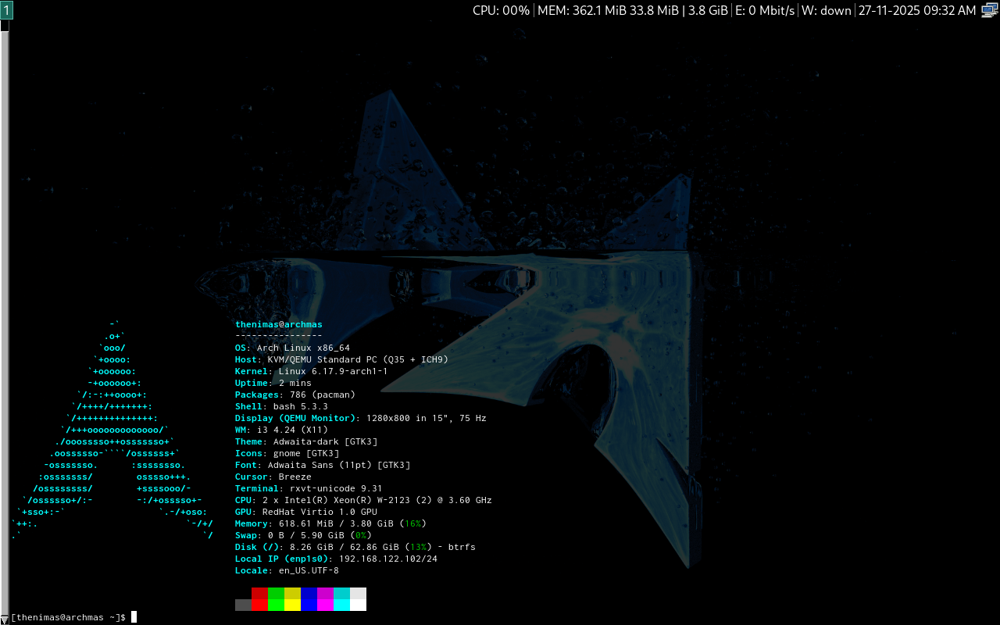

# archmas-installer
Arch-flavoured version of my [debian installation](https://github.com/thenimas/thebian-installer).


This script is intended to be run from a live environment. The easiest would be the Netboot image.
https://wiki.archlinux.org/title/Netboot

## Features
- Automated installation with encryption support
- i3 Window Manager preconfigured with my preferred bindings and visual configuration
- Preinstalled utilites for coding, file syncing and snapshotting.
- AUR integration with yay. (Flatpak is supported as wel..)

## Minimum Requirements
- 64-bit Intel or AMD CPU
- 2GB of available RAM
- 16GB of disk space 
- UEFI/GPT Booting (secure boot disabled)
- Valid internet connection (for the installation)

## Usage
The script simply can be downloaded and run as root.
```
wget https://github.com/thenimas/archmas-installer/raw/main/setup.sh
chmod +x setup.sh
sudo ./setup.sh
```

You will be given three options for the installation:
```
1. Install Arch to disk formatted with LUKS encryption (recommended)
2. Install Arch without encryption
3. Manual install to /target (advanced)
```
Encryption is recommended for security, but you have the option to just have a normal BTRFS filesystem for instances where this is not needed (i.e virtual machines.)

Manually installing to /target is primarily for when a specific partitioning setup is needed (RAID, dual booting, etc). The partition needs to be mounted at /target and with a valid partition at /target/boot/efi. Note that you must configure fstab manually.

The installation takes about 15-30 minutes on a good internet connection.